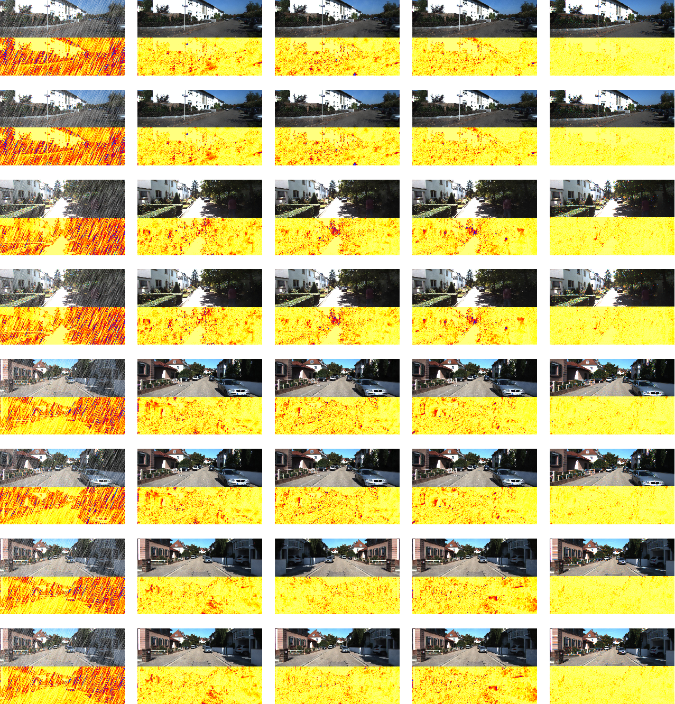
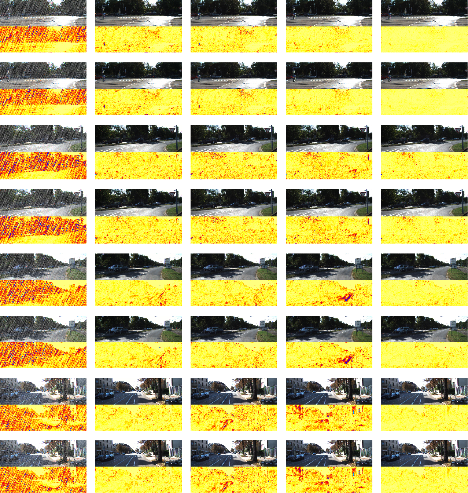
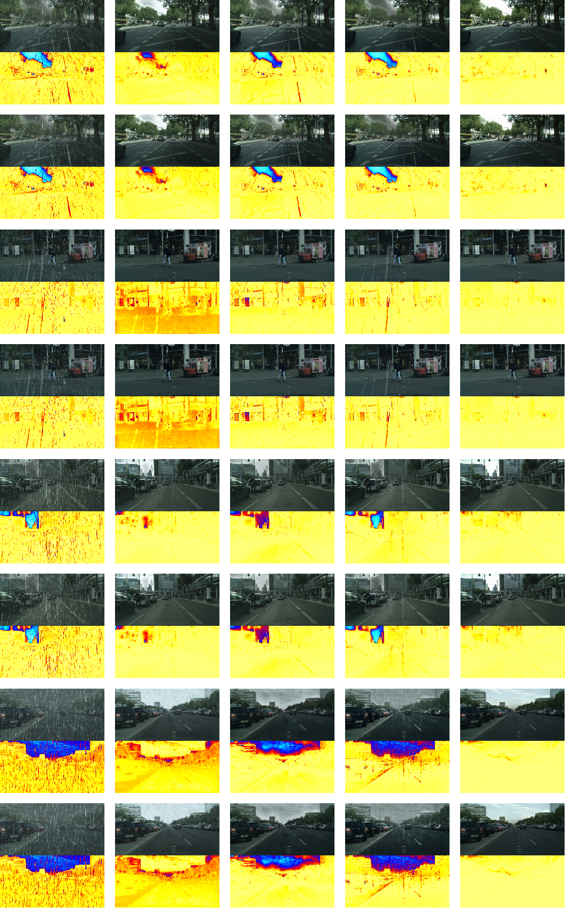

|                  |
| :----------------------------------------------------------: |
| Figure 1: Visual comparisons of the rainy images, the restored results of EPRRNet, iPASSR, NAFSSR and our proposed MQINet on RainKITTI2012 dataset. The corresponding error maps demonstrate that our model achieves the best visual performance. |
|                  |
| Figure 2: Visual comparisons of the rainy images, the restored results of EPRRNet, iPASSR, NAFSSR and our proposed MQINet on RainKITTI2015 dataset. The corresponding error maps demonstrate that our model achieves the best visual performance. |
|            |
| Figure 1: Visual comparisons of the rainy images, the restored results of EPRRNet, iPASSR, NAFSSR and our proposed MQINet on StereoCityScapes dataset. The corresponding error maps demonstrate that our model achieves the best visual performance. |

Currently this repository is ***still*** being prepared, more details will be updated soon.